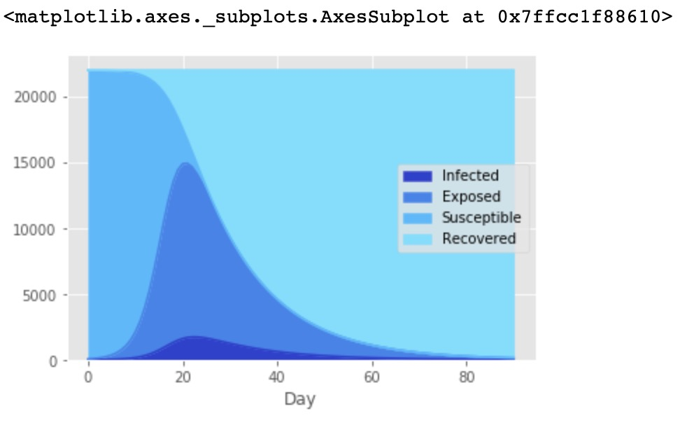

# COVID-19 Research

A Jupyter Notebook simulation using the SEIR model for the course of a pandemic, the numbers used were (extremely rough) approximations of the University of Virginia's population.

  

Packages:
It uses Pandas to process data and numpy to solve the nonlinear differential equations numerically.

